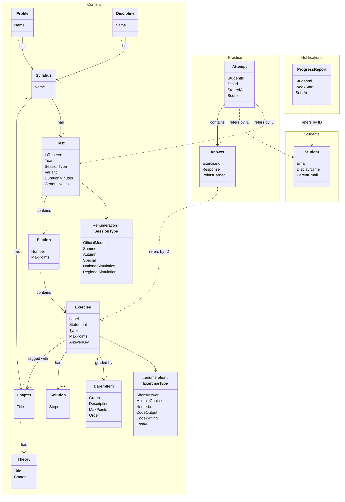

# Domain model

```mermaid
classDiagram
    namespace Content {
        class Syllabus {
            Name
        }   
        class Profile {
            Name
        }       
        class Discipline {
            Name
        }        
        class Chapter {
            Title
        }
        class Theory {
            Title
            Content
        }
        class Test {
            IsReserve
            Year
            SessionType
            Variant
            DurationMinutes
            GeneralNotes
        }
        class Section {
            Number
            MaxPoints
        }
        class Exercise {
            Label
            Statement
            Type
            MaxPoints
            AnswerKey
        }
        class BaremItem {
            Group
            Description
            MaxPoints
            Order
        }
        class Solution {
            Steps
        }
        class ExerciseType {
            <<enumeration>>
            ShortAnswer
            MultipleChoice
            Numeric
            CodeOutput
            CodeWriting
            Essay
        }
        class SessionType {
            <<enumeration>>
            OfficialModel
            Summer
            Autumn
            Special
            NationalSimulation
            RegionalSimulation
        }
    }

    namespace Practice {
        class Attempt {
            StudentId
            TestId
            StartedAt
            Score
        }
        class Answer {
            ExerciseId
            Response
            PointsEarned
        }
    }

    namespace Students {
        class Student {
            Email
            DisplayName
            ParentEmail
        }
    }
   
    namespace Notifications{
       class ProgressReport {
        StudentId
        WeekStart
        SentAt
        }
    }

    Syllabus "1" --> "*" Chapter : has
    Syllabus "1" --> "*" Test : has
    Profile "1" --> "*" Syllabus : has
    Discipline "1" --> "*" Syllabus : has 
    Chapter "1" --> "*" Theory : has
    Test "1" --> "*" Section : contains
    Test --> SessionType
    Section "1" --> "*" Exercise : contains
    Exercise "*" --> "1" Chapter : tagged with
    Exercise "1" --> "0..1" Solution : has   
    Exercise "1" --> "*" BaremItem : graded by 
    Exercise --> ExerciseType
    Attempt "1" --> "*" Answer : contains
    Attempt ..> Student : refers by ID
    Attempt ..> Test : refers by ID
    Answer ..> Exercise : refers by ID
    ProgressReport ..> Student : refers by ID

```